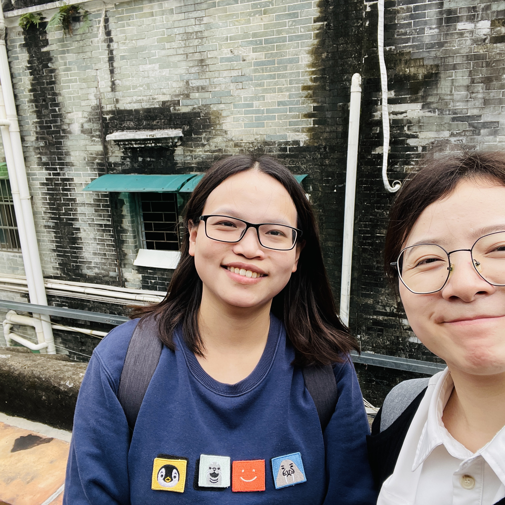
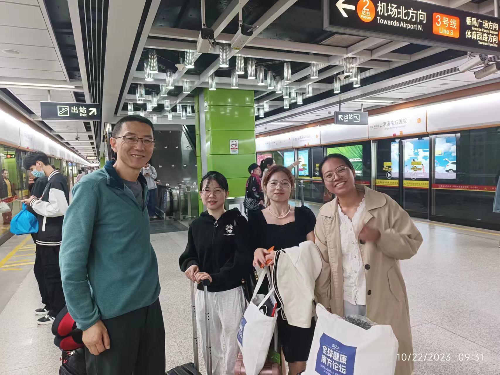

Hello, everyone!

Today, I want to share an inspiring experience: losing my ID card and the lessons I learned from it. 

My friend visited from out of town this morning, and we had plans to spend time together in Guangzhou. But just before leaving, I was shocked to discover that I had lost my ID card. Losing such an essential document might seem minor, but it can disrupt our daily life and work. I felt panicked, unsure about what to do, and reflected on how I had misplaced my ID card.

The previous day, I had gone to a local hospital to get a flu shot. I had carelessly left my ID card in my jeans' pocket. After the vaccination, I had a dinner at a restaurant and then studied at the library. Despite my efforts to find it by calling the hospital, the restaurant, and visiting the library and dormitory management, my ID card remained elusive.

Eventually, I met my friend as planned. On the subway, I coincidentally encountered my Ph.D. advisor, who was traveling with graduate students. I shared my unhappiness, and he reassured me that getting a new ID card would only take half a day, and there was no need to let it ruin my entire day. His words calmed me and brought to mind a Weibo post I had seen earlier. The post advised young people to invest their time in more meaningful pursuits and not dwell on lost items. The blogger, who often misplaced things, advocated for practical, inexpensive earphones over expensive, easy-to-lose Bluetooth ones.

I decided not to let my lost ID card affect my mood, and I enjoyed a delightful day with my friend. This experience taught me to be more responsible for my belongings and accept losses as part of life. In conclusion, life presents us with challenges and setbacks, but our responses and perspectives are crucial. Let's focus on meaningful pursuits and cherish life's beauty.

Here's a photo of me with my Ph.D. advisor on the subway and another one of me having a great time with my friend. I thought I'd share them with you. Thank you!

    
  
**My friend and I**
 
 

    
**My supervisor and my classmates**
 

