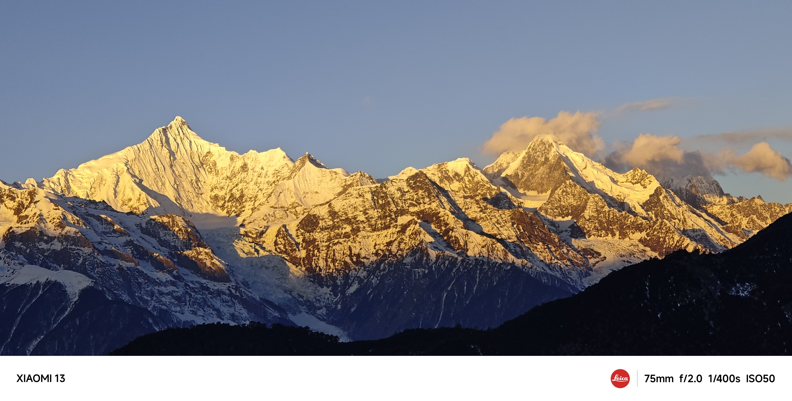
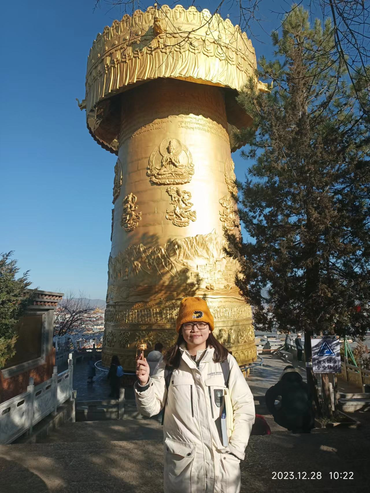
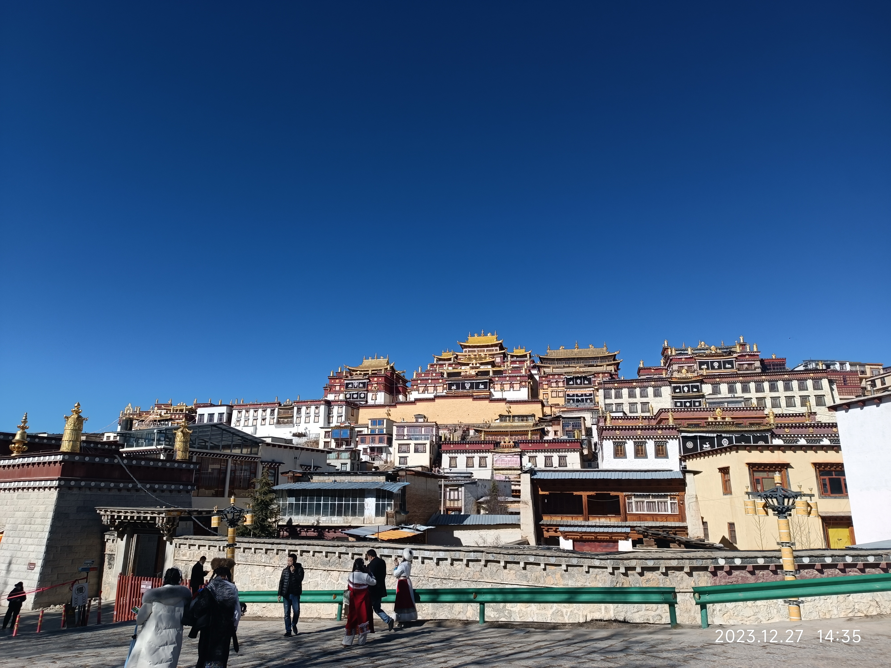
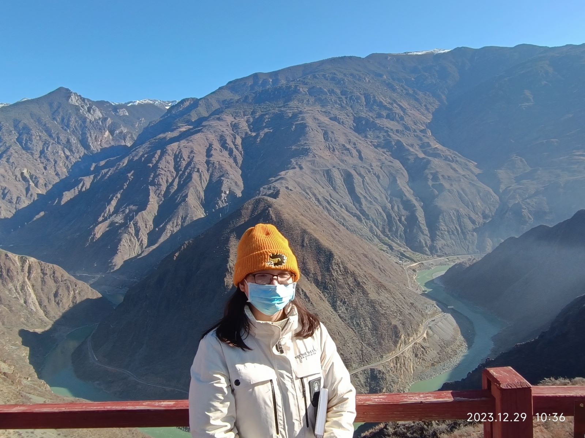
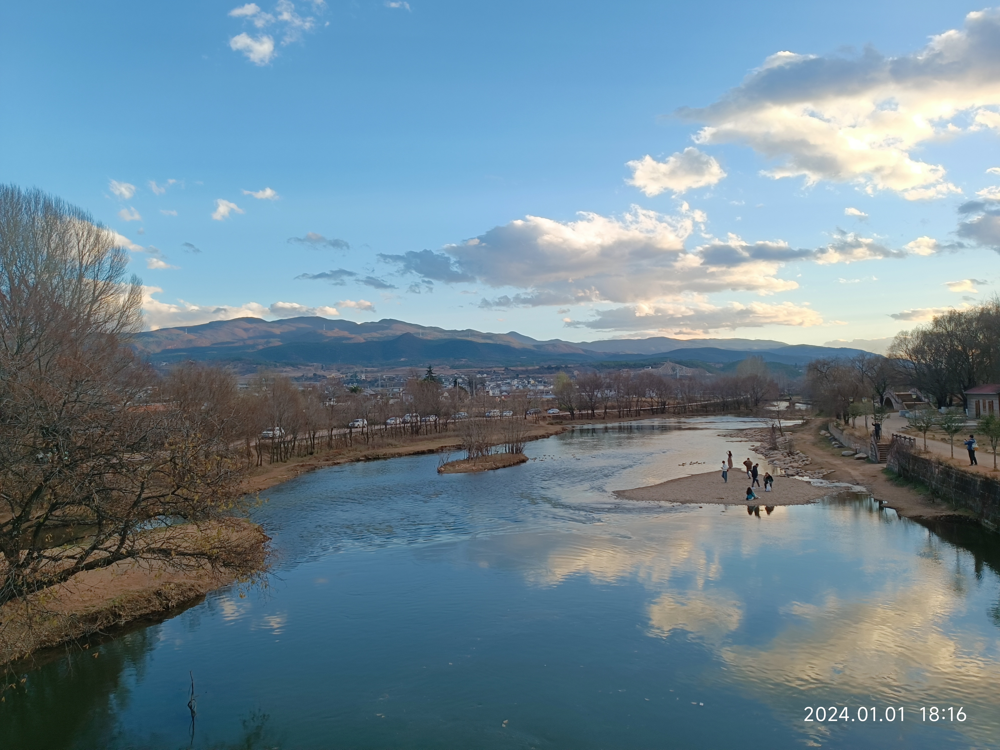
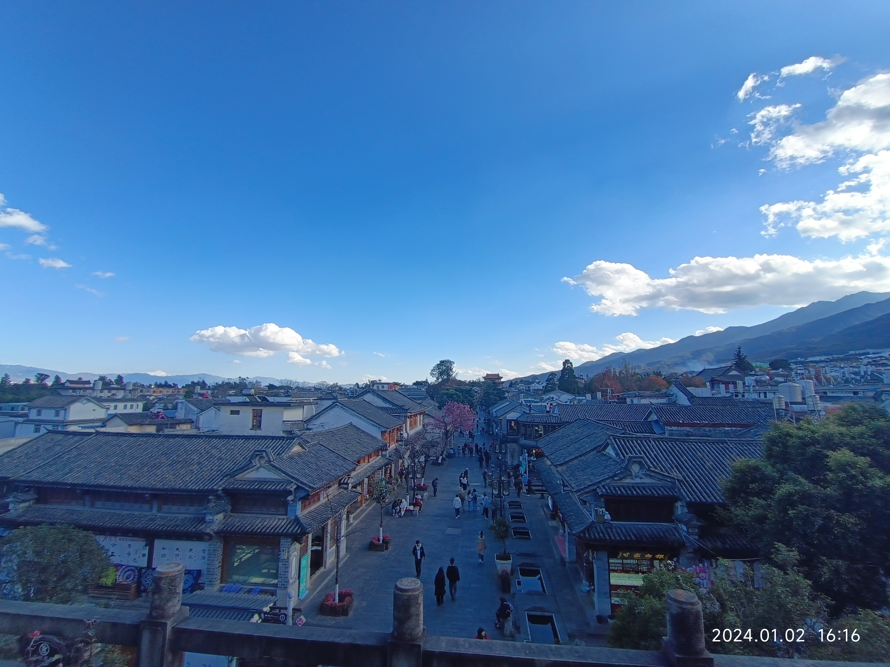
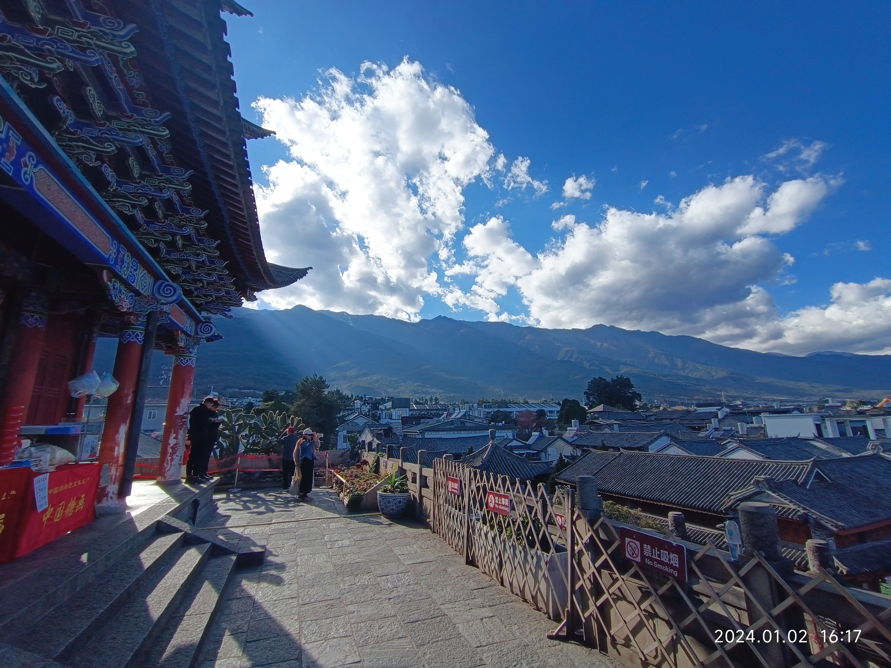

在微博看到一个年终总结模板，挺齐全的，也进行自己的年终总结吧，便于未来有回看的坐标~
1. **你今年做了哪些之前从未做过的事？** 辞职？哈哈
1. **你有没有遵守年初时和自己许下的约定？** 没有，并没有申请上海外博士，而且是自己的原因~
1. **你身边有人生孩子了吗？** 有啊，好多呢，恭喜大家进入新阶段~
1. **你身边有人去世了吗？** 我身边没有，感恩上帝。
1. **你去了哪些城市/州/国家？** 去了广东韶关（做项目），湖南长沙和邵阳（龚老师课题组实习），江苏泰州（小王婚礼），云南香格里拉大理丽江（旅游）
1. **明年你想要获得哪些你今年没有的东西？** 出国？钱？亲密关系？
1. **今年的哪个或哪些日子会铭刻在你的记忆中，为什么？** 出国没成功吧...碎碎念
1. **你今年最大的成就是什么？** 发表了一篇SCI、变得更加平和也接纳了
1. **你今年最大的失败是什么？** 出国
1. **你今年还遇到过哪些困难？** 不太擅长人际关系，特别是和老板相处，不过我老板非常好，很包容我了
1. **你今年是否生过病或受过伤？** 嗯嗯，我的脚，还有情绪问题，还有龋齿。
1. **你今年买过的最好的东西是什么？** 好像没啥？
1. **今年你大部分的钱都花到哪里去了？** 吃饭哈哈，恩格尔系数可高啦。
1. **有什么事让你感到超级、超级、超级兴奋？** 挚友小王结婚吧，恭喜她进入人生新阶段~
1. **哪首歌会永远让你想起这一年？** Yiqin的几首歌，比如叫你一声姐妹、二十五岁
1. **与去年的这个时候相比，你是：感到更快乐还是更悲伤了？变得更瘦还是更胖了？变得更富还是更穷了？** 更快乐了-因为接纳自我；体重好像没有变化哭；更穷了因为开始读博士了。
1. **你希望自己能做得更多的是什么？** 发文章、学习英语和编程
1. **你希望自己能做得更少的是什么？** 内耗和责备自己不好好学习，我不太能接纳自己不把时间花在非工作学习上，这点要改~
1. **你今年坠入爱河了吗？** 呵呵没有...
1. **你今年读过最好的一本书是什么？** 今年没怎么读书，不超过5本。如果要选一本，就是许知远的《青年变革者》吧
1. **你今年发现的最好听的一首歌是什么？** 二十五岁
1. **你今年看过最喜欢的一部电影是什么？** 必须长安三万里！
1. **你今年吃过最好吃的一顿饭是什么？** 回家的饭~
1. **有什么是你想要且得到了的？** SCI
1. **有什么是你想要却没有得到的？** 海外博士offer
1. **你生日那天做了什么？** 普普通通的过了
1. **有什么还未发生的事，如果发生了，会让你的这一年变得无比满足?** 海外博士offer？亲密关系？
1. **你会如何描述你今年的个人时尚风格？** 我一直不怎么时尚...要改改了。不过小伙伴说我会比之前好些嘿嘿
1. **今年你最欣赏哪个名人/公众人物？** 微博*子陵在听歌* 有实力、有社会责任心、文笔好，很佩服~
1. **今年哪个政治问题最令你有感而发？** 美国倒退，推翻堕胎法令吧
1. **你想念哪些人？** 好像没有
1. **今年在你有新认识朋友吗？** 有的，博士同学、课题组合作者
1. **今年你学到了什么宝贵的人生经验？** 接纳自己是普通人，可能这辈子的天花板就在那儿，不过还是希望能多看多经历美好的人生
1. **能够总结你这一年的一句话是什么？** 边走边看，顺其自然
1. **对明年有什么期待？** 家人平安健康，自己顺利，心态变好~

 
 
年底去了云南，贴上每个地方最喜欢的两张图吧~

   
**香格里拉：梅里雪山日照金山**
 
 

**香格里拉：独克宗古城的转经筒**
 
 

**香格里拉：松赞林寺**
 
 

**香格里拉：金沙江大转弯**
 
 

**丽江：丽江古城1**
 
 

**丽江：丽江古城2**
 
 

**大理沙溪：玉溪桥**
 
 

**大理：大理古城1**
 
 

**大理：大理古城2**
 

