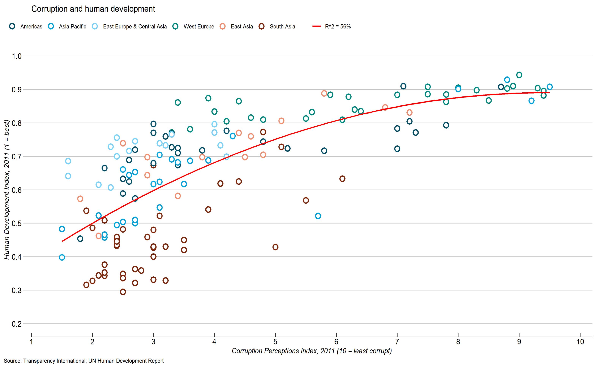

Since December 2023, I have been enrolled in the data engineering course offered for free by Professor Dongbo Shi at Shanghai Jiao Tong University. I have acquired a wealth of knowledge in data science, covering *command line usage*, *Git*, *SQL fundamentals*, as well as basics of *R and Python*, *data visualization*, and *quasi-experimental methodology*. Now that the course has reached its halfway point, despite feeling fatigued by the workload and assignments, I have indeed learned a lot and have some thoughts to reflect:

1.  Professor Dongbo Shi and other Tsinghua students truly possess remarkable abilities. His transition from physics to public administration, and the fact that he only began learning R language in his fourth year of his Ph.D. (2015), yet managed to apply his professional knowledge and programming skills to publish in [Science](https://www.science.org/doi/full/10.1126/science.abq1218) in 2023, is truly impressive. I started exploring R language in the fall of 2021, and it's been almost three years, but I've only scratched the surface, haha.

2.  Programming languages are a form of language and should be learned early on. Many people around me suggest learning as needed, claiming that methodologies are just tools, and analysis can be done using **SPSS**. However, based on my learning experience, programming languages are similar to learning English. Only by mastering these languages can one gain access to more information and broaden their perspective. I **strongly advocate** for incorporating computer science-related knowledge into social science **undergraduate curricula**.

3.  Professor Shi mentioned several articles in scientific economics during class, which was eye-opening. For instance, the discussion on the death of academic stars and how it can actually promote the development of the discipline. Following *altruistic academic stars* can lead to better academic growth, while following selfish stars may result in becoming mere workers in a sweatshop. He also discussed his own article in [Science](https://www.science.org/doi/full/10.1126/science.abq1218), where the Chinese government initiated the *Young Thousand Talents Program*, supporting young scholars' productivity upon their return to China compared to their peers who remained overseas.

4. I strongly agree with his viewpoint and aspire to embody it in the future: knowledge is a public good and should be shared freely with students. I hope that in the future, I can, like him, extend assistance to young students.

5.  A heartfelt thanks to Professor Shi for generously sharing his guidance!

  

  
A graph created using **`ggplot2`**, designed in the style of *The Economist*
