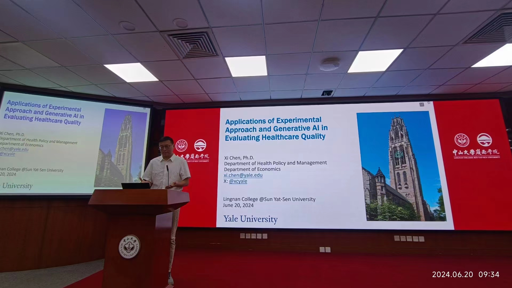
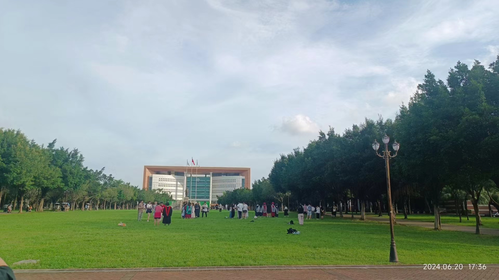
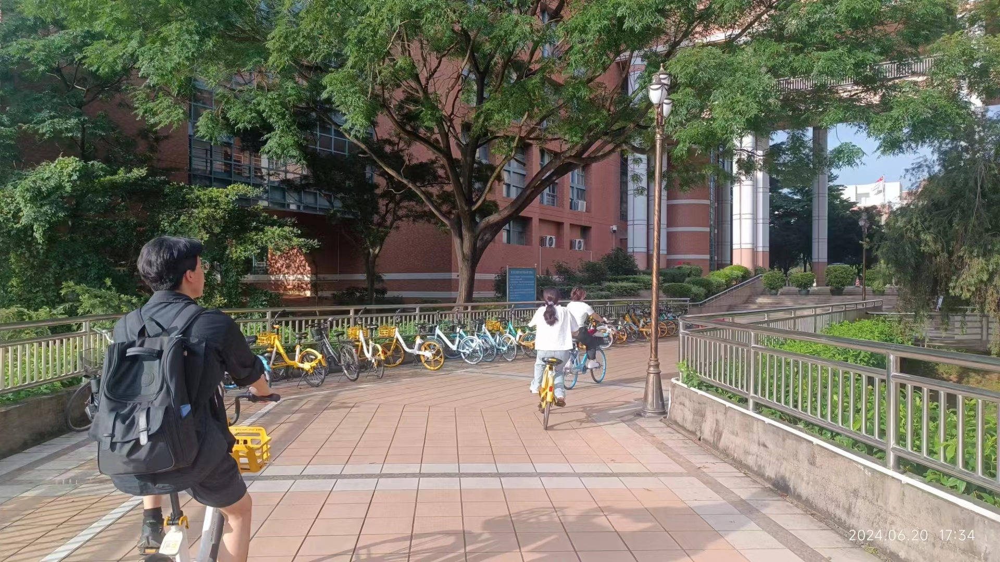
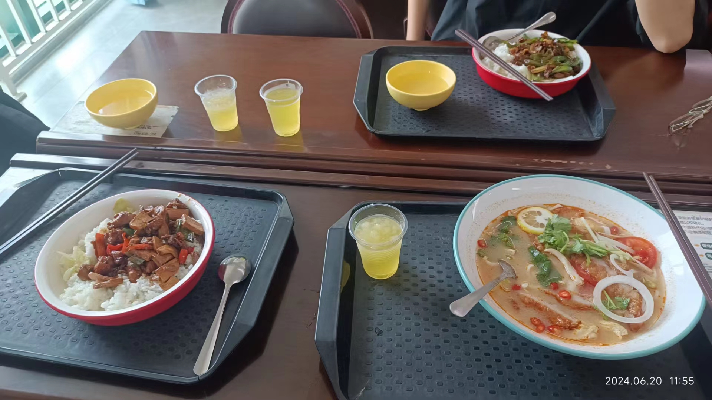

今天和朋友们一起去听了耶鲁公卫卫生经济学家陈希教授的两场讲座，收获很多，把一些想法记录下来，也作为未来回看的坐标。第1场是在中大岭南学院，主题是标准化病人和生成式ai评价医疗质量。第2个研究是介绍采用机器学习探究儿童早期生活状态对老年时期认知状态的影响，判断了近500个影响因素变量。总体而言非常佩服他卓越的学术能力和绅士风度，让我对经济学，对数据，对学科也有了一些新的想法：

（1）国外的数据会丰富很多，而且更为重要的是数据之间的连接性。比如说美国的医保数据和人口调查数据HRS等等是可以结合的，就可以进行更多维度的分析。我国最著名的追踪调查Charls目前来说是不可以，但是听说赵耀辉老师在武汉大学会把它做起来。另外，陈老师还会使用zip code的连接数据去判断经济发展水平。

（2）拥抱新技术。第2场陈希教授的汇报主要是机器学习去探究生命早期环境与人的长期发展关系，运用了机器学习方法降维了500个变量，并且采用各种数据库（经济学、医疗质量、地理信息）去合并每个人的变量，这也就涉及到经济学、医学、计算机、地理信息等等学科的知识。

（3）学科之间审美不同。第1场讲座更多的是一个实验研究，又因为和自己的领域相近，所以听讲的时候不是很吃力。第2场讲座有很多经济学定量、经济学专家和研究的背景，听讲的时候有点吃力。唉，其实做好社科研究更需要的还是经济学背景和计算机知识吧，但是有多少人能在比较小的时候就确定自己未来想要做什么呢？我现在能想到的解决方法就是多和经济学和计算机学习、多看点文献、有机会再去这些环境里学习吧；另外学科之间的审美区别也比较大。就我自己的感受来说，公卫、卫管、护理比起经济学还是更强调于干预，有着社会工作的属性在里面，经济学更可能应用稳健的方法判断数据。这里指的是大多数经济学，因为也有少部分经济学会做干预研究，比如发展经济学，19年诺奖获得者就是采用干预方法改善贫困。上午岭南学院的老师同学提问，和下午政务提问的内容也有不同，岭南学院是经济学专业，也更侧重于定量基础，讲究fix effect，还有变异等等，而政务学院是公管专业，会更宏观一些。

（4）很佩服陈希教授个人的学术能力，几乎是一个行走的高质量文献库。演讲时他就旁征博引了很多的文献作为佐证，不仅能说出每个研究内容，还能记得研究发表的杂志；除了演讲之外，提问环节的每个问题他都能引经据典提出现有的高质量证据。举个例子，当提到ChatGPT判断医疗质量时，非传染性疾病可能会比传染性疾病的质量更高，然后我们提到说是不是ai还会有一些算法不公平在里面，他就能提出某某文献某某人做的研究，黑人和白人在医疗保险的判断算法中可能截断值都不一样。感受到他的天赋、努力、和兴趣都达到了极值。

坦白说第2个演讲我没有完全跟得上，还是要补充很多基础知识，因此本次记录应该会有不少偏倚。现在记下来，是希望后面能看懂，也能对比出自己今后的成长吧。我很久没有听过这么引人思考的演讲了，不论是从idea还是从文献积淀或汇报者个人风度的角度来说。很感谢。

有个题外话，哈哈。今天会议结束后，我拉着小伙伴们一直等到宾客散去。然后跟着陈希教授到了休息室，最后还是走上前去实在忍不住问他：很想问问您是否认识YF？

 

 

 

 

 

 

 

