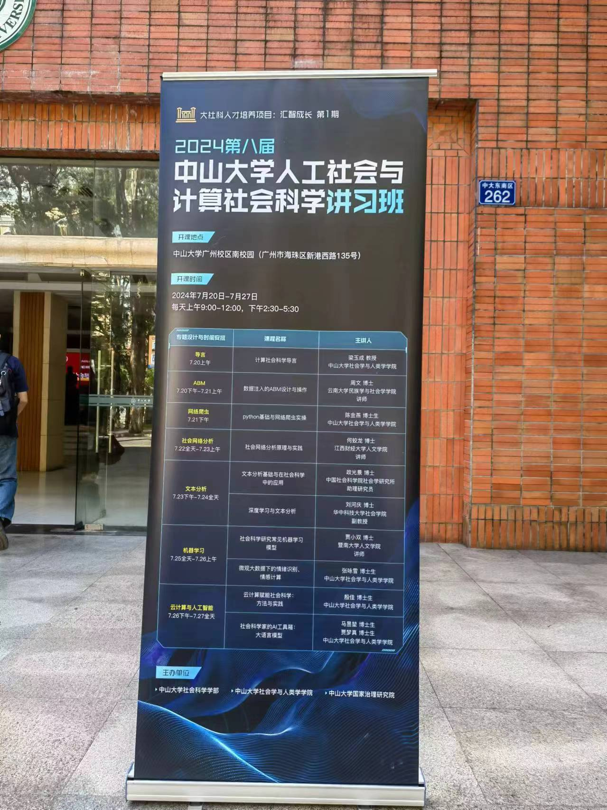
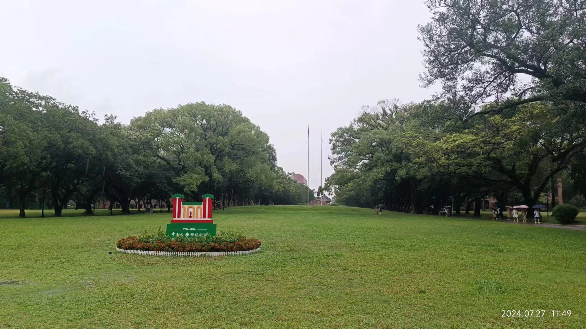
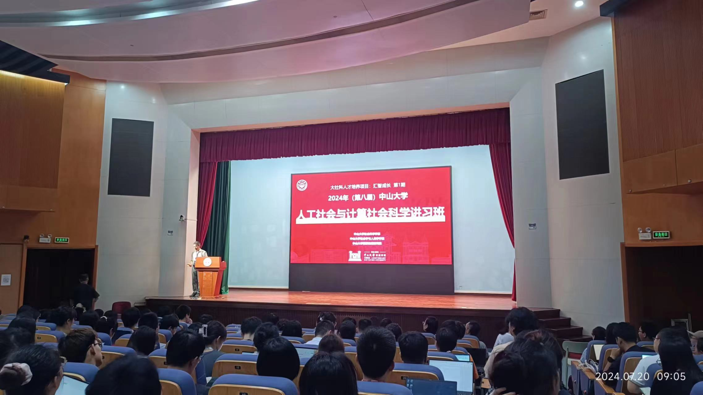

The Computational Social Science Workshop at Sun Yat-sen University wrapped up yesterday, and I'm still feeling a bit out of sorts. When I first arrived, I never imagined that I'd not only gain so much knowledge but also feel such a strong sense of farewell. The weather over these eight days was pretty extreme—either blazing sun or pouring rain—but the Sun Yat-sen University campus felt like the most beautiful place.

I want to express my gratitude to the organizers for their top-notch course design and detailed event planning. The speakers were incredibly generous in sharing their expertise on the theories, methodologies, and latest developments in computational social science. It was also very thoughtful that there were no fees, which is great for young students.

I also want to give a big thank you to the teachers and students from various schools and disciplines who attended this workshop. We had open and inclusive discussions, offered constructive feedback to each other, and avoided getting stuck in disciplinary rivalries. I learned so much, made many new friends, and even got to chat in person with a professor I had connected with online years ago.

A special shout-out goes to the workshop's teaching assistants, especially the five PhD students—Jinyan Chen, Yongxue Zhang, Yukun Ma, Mengzhen Jia, and Jia Yin. They graciously allowed us to roll in this course and handled most of the logistics, including event coordination and teaching assistance. They joined us for lunch, shared openly, and showcased not only their professional and programming skills but also the empathy and social responsibility typical of social science students. The image of a Sun Yat-sen social science student has become very vivid in my mind, and I have great respect and affection for them. I'm grateful for this brief encounter, and though we must part ways, I hope we can cross paths again in the future.

On the academic side, the biggest lesson I've learned from this workshop is that my self-study efforts won't quite match the level of those who have the right environment and previous experience. I should stick to my main field and continue working on health behavior interventions with my PhD supervisor. Computational science can stay a hobby.

Lastly, a big thank you to my study group of four for our early starts and late nights. I'm lucky to have met such like-minded friends; coordinating taxis, meals, and work isn't easy. Haha, so what event should we join next?

 

road map
 

campus
 

classroom
 

campus-2