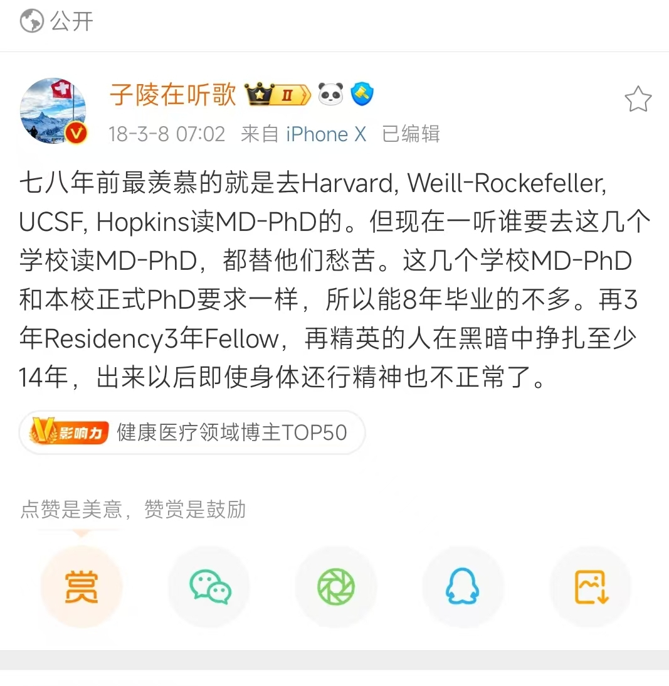

最近对卫生政策研究的学习路径有了一些新的想法。我觉得做卫生政策其实很难。一方面要医学知识，一方面也要经济学知识。这两个都是需要很长时间训练，大部分人获得一个就差不多进入职业生涯了。

而且卫生政策有个点在于，是需要政府推动和政府资源的，年轻学者哪儿有这个资源。这就意味着能做真正卫生政策研究的，是国家头部的机构和学者。其他卫生政策都是做类似社会工作的卫生服务研究，或者医院管理，药物经济学等等。这些限制导致卫生政策研究发展是有阻碍的，但是这个领域又很重要，能够广泛的决定民众基本权利。

医学知识，实际的公卫卫健系统运行经验，经济学知识，政府资源------能有1-2个就差不多了。但是要做好，是不是都要有。我前段时间听北大国发院的健康经济学汇报，包括参加潘杰老师举办的卫生政策大会，尤其这么觉得。纯粹经济学背景的年轻学者，初期的研究难以涉及医学的实际落实，更多是分析变量之间的关系。另外，卫生政策领域还是需要丰富的社会资源，并且要求有较高的智商，而这两点似乎我都不具备...

我把我的困惑咨询了三位非常尊敬的老师，老师的建议都是，先做好自己能做的吧。哎，我也不知道怎么办，走一步看一步了。

20241204 更新：查了Association of American Medical college的网站，美国有数十所医学院开设了561个M.D. + Ph.D.的项目，除了基础医学的PhD项目，还包括计算机、流统、社科如经济学和社会学等PhD项目，见 [MD-PhD in Social Sciences or Humanities and Other Nontraditional Fields of Graduate Study](https://students-residents.aamc.org/md-phd-dual-degree-training/md-phd-social-sciences-or-humanities-and-other-nontraditional-fields-graduate-study) 想起来关注的几位做出医学+社科大型成果的，都是这个项目出来的。试想一下，哈佛医学院+哈佛经济学双博士做卫生政策研究，大概率比单一学科的博士做得好吧，现在哈佛校长也是MD+经济学博士背景，做卫生政策研究~

不知道国内的培养是什么样？目前浙大的md+phd实质上是医学专博+医学学博，还是医学口的学科。我还没有查清楚其他高校的MD+PhD项目是否也偏向医学学科，但大概可以推测，国内的培养体系中，医学与社科学科的结合仍然很少见。

这让我稍微想清楚，为什么我国卫生经济学的教授大多只有经济学背景，而医学背景的学者从事卫生政策研究时，往往只能聚焦于药物经济学和卫生经济评估等领域，基本上算是经济学的延伸研究。这些问题归根结底，还是培养路径的缺乏。

看到子陵第二张图，只能默默感叹即便再好的培养路径、再优越的背景，大家都有各自困难的地方～

